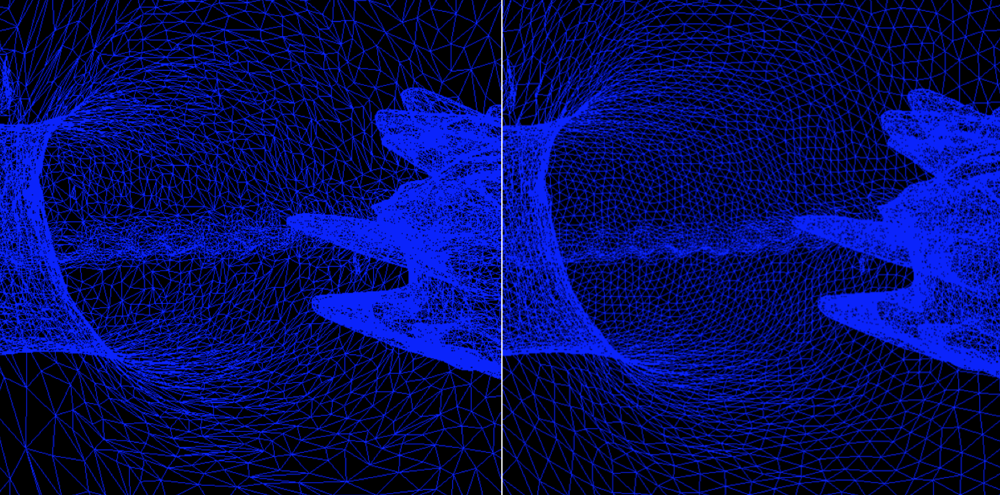

# remesh 

The goal of surface remeshing is to improve the quality of a mesh and to optionally increase upsample or downsample its resolution. Here, mesh quality refers to non-topological properties such as vertex sampling and face size, alignment and regularity (i.e., we want triangles that are somewhat equivalateral). Remeshing algorithms often compute point locations on or near the original surface and iteratively relocate vertices to improve mesh quality. This implementation uses the algorithm by Botsch et al. (A Remeshing Approach to Multiresolution Modeling) to generate isotropic triangle meshes in an efficient and robust manner. The algorithm is iterative and consists of a sequence of edge flips, splits, collapses and vertex relocations. 

Note: Requires Eigen 3.2.4 and assumes it is in /usr/local/Cellar/eigen/3.2.4/include/eigen3/
